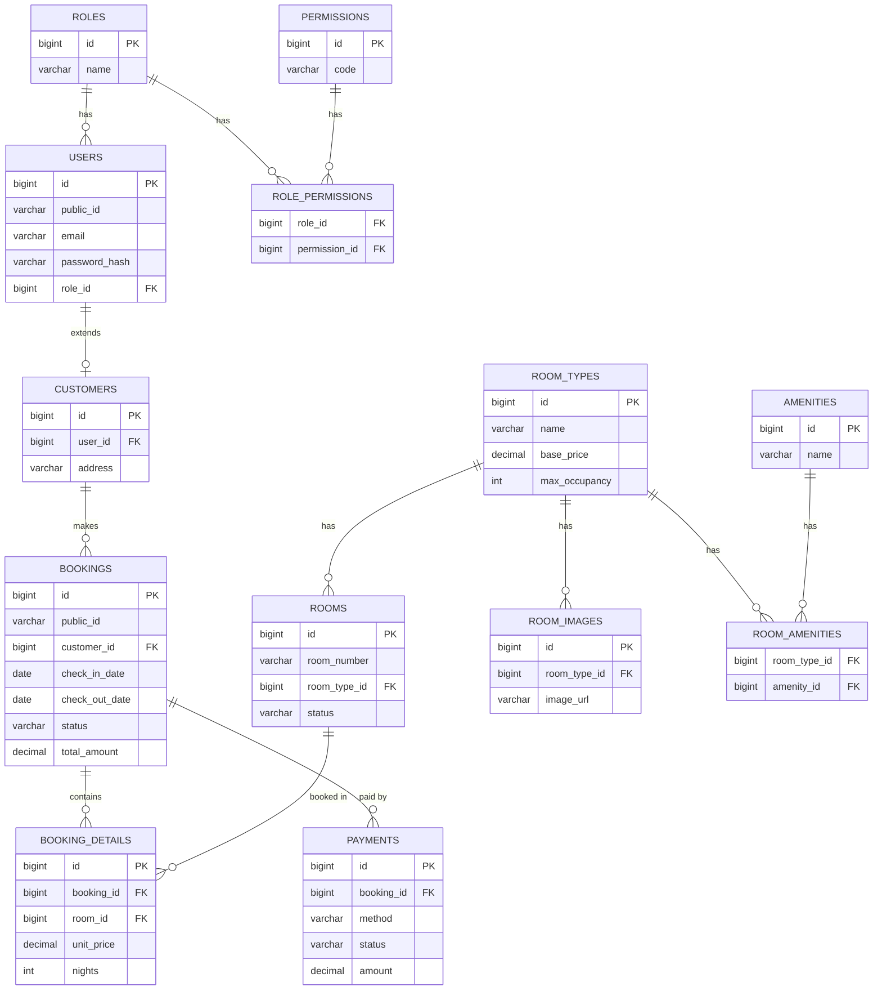

# ERD — Hotel Management System (Release 1 MVP)

## Giải thích quan hệ chính

- **ROLES 1—n USERS**: 1 role có nhiều user, mỗi user chỉ thuộc 1 role.
- **ROLES n—n PERMISSIONS** (qua `ROLE_PERMISSIONS`): 1 role có nhiều quyền, 1 quyền có thể thuộc nhiều role.
- **USERS 1—1 CUSTOMERS**: chỉ user có role Customer mới có bản ghi mở rộng trong `customers`.
- **CUSTOMERS 1—n BOOKINGS**: 1 khách có thể có nhiều đơn đặt phòng.
- **ROOM_TYPES 1—n ROOMS**: 1 loại phòng áp dụng cho nhiều phòng vật lý cụ thể.
- **ROOM_TYPES n—n AMENITIES** (qua `ROOM_AMENITIES`): 1 loại phòng có nhiều tiện nghi, 1 tiện nghi dùng cho nhiều loại phòng.
- **BOOKINGS 1—n BOOKING_DETAILS**: 1 booking có thể đặt nhiều phòng cùng lúc.
- **BOOKINGS 1—n PAYMENTS**: 1 booking có thể có nhiều lần thanh toán (ví dụ đặt cọc + thanh toán còn lại).